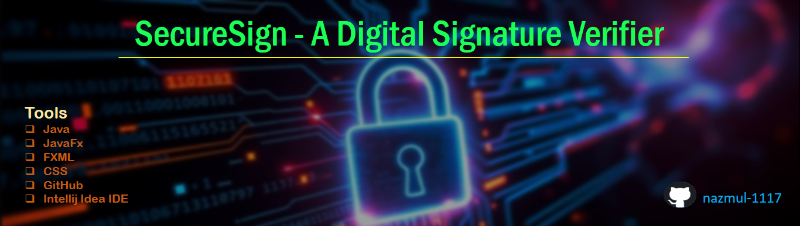

# SecureSign - A Digital Signature Verifier 📝

This is a JavaFX application that demonstrates the core concepts of **digital signatures** using the RSA and SHA-256 algorithm. It's a tool for generating key pairs, signing documents, and verifying the authenticity and integrity of those signed documents.

[](https://github.com/nazmul-1117/SecureSign)
[](https://github.com/nazmul-1117/SecureSign)
[](https://github.com/nazmul-1117/SecureSign/issues)
[](https://github.com/nazmul-1117/SecureSign)
[](https://github.com/nazmul-1117/SecureSign)
[](https://github.com/nazmul-1117/SecureSign)
[](https://github.com/nazmul-1117/SecureSign)
[](https://github.com/nazmul-1117/SecureSign/graphs/contributors)
[](https://github.com/nazmul-1117/SecureSign/forks)
[](https://github.com/nazmul-1117/SecureSign/stargazers)
[](LICENSE)



-----

## Key Features

* **Key Generation**: Create and save RSA public and private key pairs.
* **Apply Hashing**: Apply SHA-256 hashing algorithm on original document
* **Document Signing**: Use a private key to generate a digital signature for any file, ensuring its integrity.
* **Signature Verification**: Use the corresponding public key to verify that a signed document has not been tampered with.
* **User-Friendly Interface**: A simple, intuitive JavaFX interface guides the user through the entire process.

-----

## How it Works

The application follows a standard cryptographic workflow. First, the content of a document is passed through a hashing algorithm (**SHA-256**) to create a unique fingerprint. This fingerprint is then encrypted using the sender's **private key** to produce the **digital signature**.

For verification, the receiver independently hashes the document and uses the sender's **public key** to decrypt the digital signature. If the two hashes match, the document is considered authentic and its integrity is confirmed.

-----

## Preview
<p align="center">

  
  
</p>

- **For Check More Images Please** [Click Here](https://github.com/nazmul-1117/SecureSign/tree/main/static/images/project_image)


## Requirements

* Java Development Kit (JDK) - 8 or later
* JavaFX SDK - 8 or later
* Intellij Idea - 2025.2 or later
* Scene Builder - 24.0.1 or later
* jfoenix - 9.0.10 or later

-----

## Getting Started

1.  **Clone the repository**:
    ```bash
    git clone https://github.com/your-username/your-repo-name.git
    cd your-repo-name
    ```
2.  **Run the Application**:
    * Open the project in your preferred IDE (like IntelliJ).
    * Set up the JavaFX SDK.
    * Set up the jfoenix module
    * Run the main application file.

-----

## Usage

1.  **Generate a Key Pair**: Use the "Generate Key Pair" button to create `private.key` and `public.key` files. Keep your private key safe\!
2. **Hashing Generate**: Select a original readable document and apply SHA-256 hashing algorithm on it and create a`.hash` file 
3. **Sign a Document**: Select a `.hash` file and your private key, then click `Sign Document` to create a `.sig` file.
4. **Verify a Signature**: Select the original document, the `.sig` file, and the public key, then click "Verify Signature" to see the result.

-----

## Contributing

Feel free to open issues or submit pull requests with improvements. All contributions are welcome\!

-----

## License

This project is licensed under the MIT License. See the `LICENSE` file for details.
