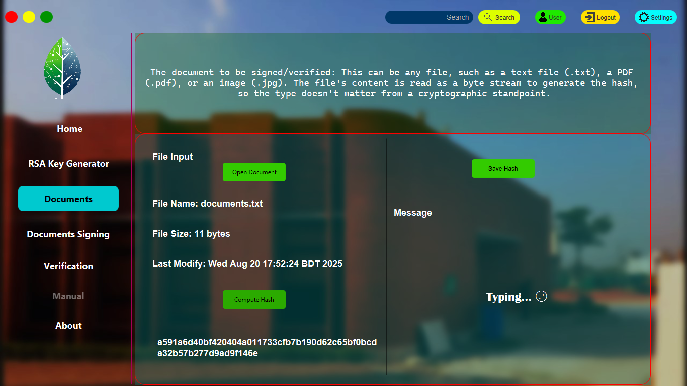
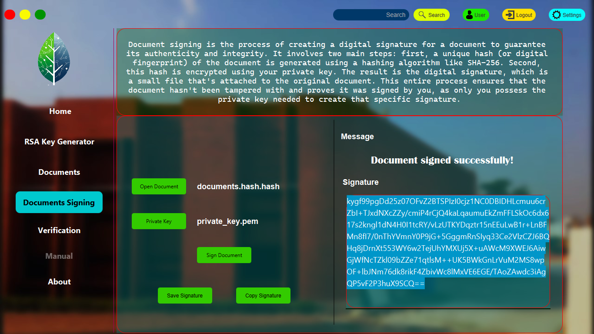
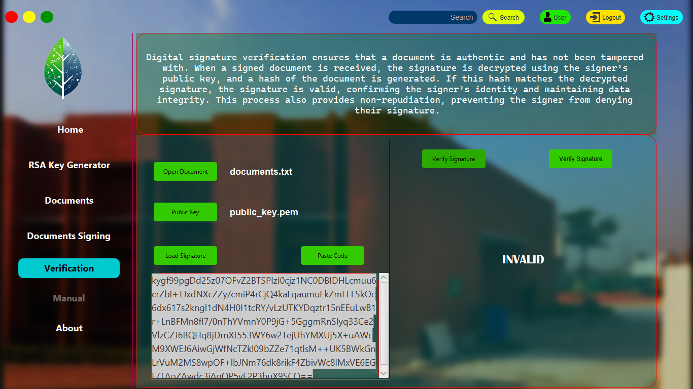
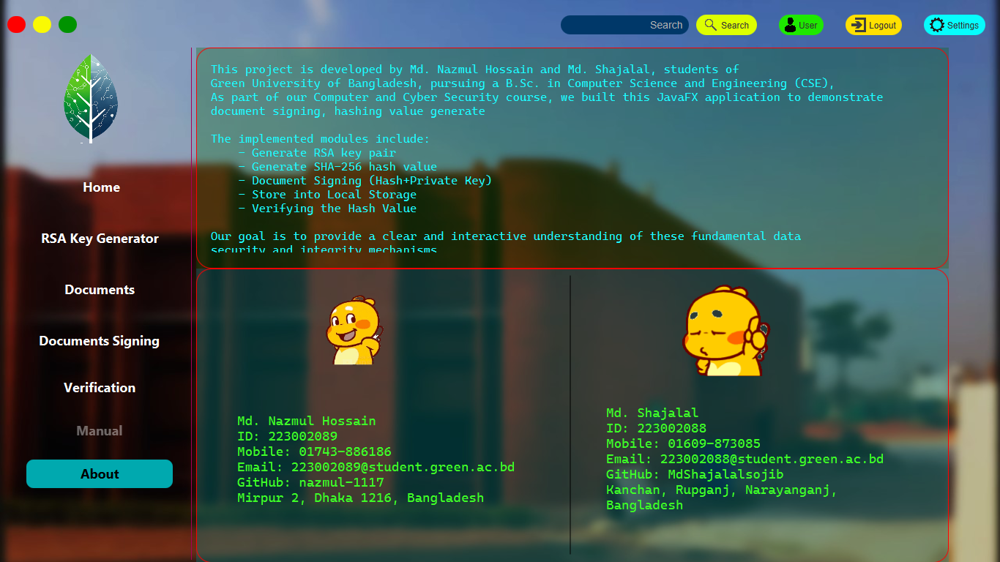

# Projects Screenshot
- After Run this project (ex. Using Intellij Idea IDE)

## Home

## Generate RSA pair of Key

## Apply SHA-256

## Signing Document

## Verify Signature - Document

# About
